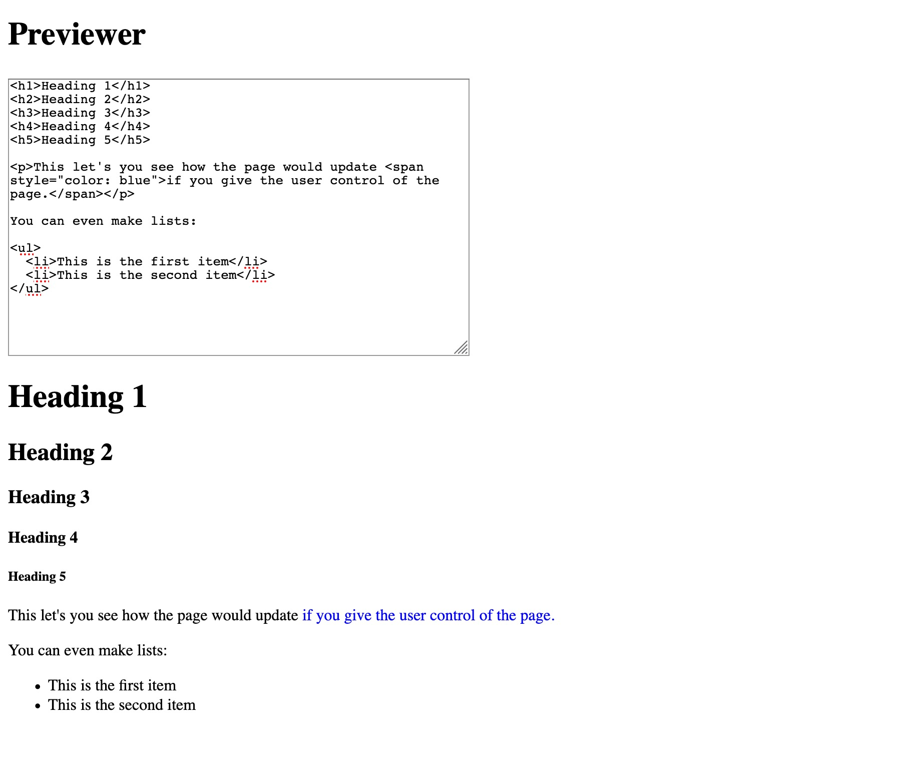

# HTML Previewer

> This app uses vanilla JavaScript to automatically show a preview of user `html` input.

## Core Concepts

* Event Listeners
* DOM manipulation

## Instructions

Create an app that takes user input and previews it on the page in real time. The page should update `on input` (\*wink wink\*).

The final solution should look something like:

